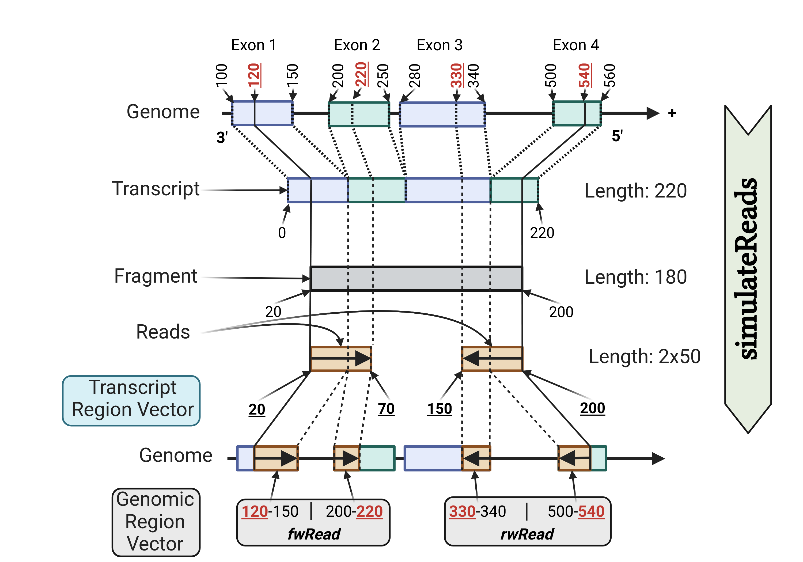

# Read Simulator

## Usage
```sh
java -jar readSimulator.jar 
     -length <readLength>
     -frlength <fragmentLength>
     -SD <standardDeviation>
     -mutationrate <mutationRate (1.0 == 1%)>
     -gtf <"./inputFiles/Homo_sapiens.GRCh37.75.gtf">
     -fasta <"./inputFiles/Homo_sapiens.GRCh37.75.dna.toplevel.fa">
     -fidx <"./inputFiles/Homo_sapiens.GRCh37.75.dna.toplevel.fa.fai">
     -readcounts <"./inputFiles/readcounts.simulation">
     -od <"outputDir">
     [-debug]
     [-transciptome <"Homo_sapiens.GRCh37.75.cdna.all.fa">]
```
## Background 
In bioinformatics, **Sequencing** is a term used to describe the process of gathering
genomic data by reading the nucleotides of a DNA molecule. This is done by a **sequencer**.
There are different types of sequencing techniques (e.g **Illumina** (next generation sequencing), **Oxford Nanopore**,
**Pacbio** (third generation sequencing), etc.)
and different variants of **sequencing** (**ATAC-seq**, **scRNA-seq**, **ChIP-seq**, ...).

The simplified process of **Illumina** sequencing is as follows:
Several DNA target sequences get treated with ultrasound
in order to break them down into smaller fragments of a certain length with a certain margin of error (e.g. 200 bp +/- $x$ bp).
These fragments are labeled, placed onto a flow cell, amplified, and sequenced.
This generates an abundance of short reads, which often overlap with each other and contain mutations.
The reads are then aligned to a **Reference Genome** via a **Mapper** like **STAR** in order to determine the original sequence.
A **Read Simulator** is a tool that simulates this process of generating fragments and reads for given transcript sequences.
In our case, we simulate a paired-end sequencing experiment, where we generate two reads for each fragment, one for each end of the fragment.
With a **Read Simulator**, we are able to validate the results of **Mappers** since we know where our reads originated from.
In other words, if a **Mapper** was to incorrectly map a read (generated by our **Read Simulator**) to the **Reference Genome**,
we could detect this faulty behavior and see how far off the **Mapper** was to the actual coordinates.
Like this, we could also detect entire regions inside the **Reference Genome** where the **Mapper** struggles in general (e.g. highly repetitive regions).
A downside of this **Read Simulator** is that it assumes a normal distribution of fragment lengths and
their starting position inside the transcript and a constant mutation rate across the entire read sequences, which in reality is not the case.
However, it is still a valuable tool for testing the performance of other tools.




> This figure was created using BioRender. For more information, visit [BioRender](https://BioRender.com).
